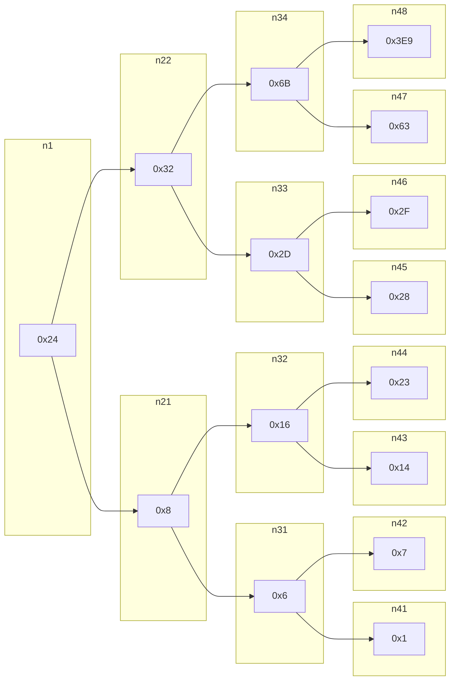
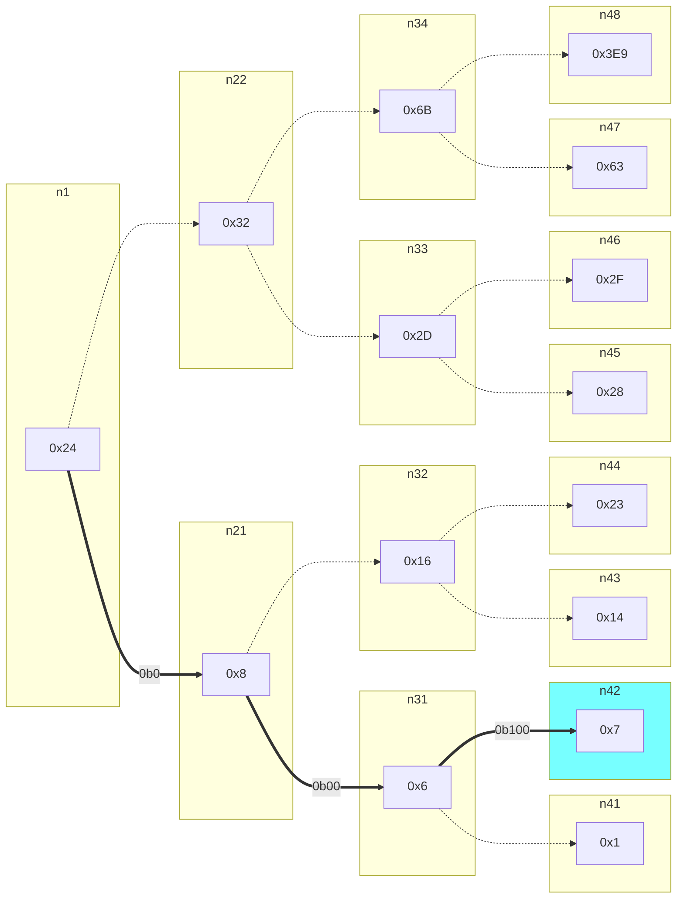

# CSED211 - Lab3 (bomblab) Report

**20220140 Taeyeon Kim**

[toc]

## Before

**Lecture에 나오는 AT&T Syntax가 아니라 Intel Syntax를 사용하여 분석했기 때문에, 연산자의 이름이나 피연산자의 순서가 Lecture와 다를 수 있습니다.**

**Plain한 GDB가 아닌, GDB에 memory layout이나 register를 편하게 볼 수 있는 플러그인인 GEF (Gdb Enhancing Features)를 설치하여 사용했기 때문에, 조금씩 화면 내용이 다를 수 있습니다.**


## `main()` and initializing functions

`disas main`으로 (다행히도) unstripped binary여서 symbol들로써 함수의 역할과 instruction 및 logic을 어느 정도 유추할 수 있다.

```assembly
0x0000000000400dbd <+0>:     push   rbx
   0x0000000000400dbe <+1>:     cmp    edi,0x1
   0x0000000000400dc1 <+4>:     jne    0x400dd3 <main+22>
   0x0000000000400dc3 <+6>:     mov    rax,QWORD PTR [rip+0x2039be]        # 0x604788 <stdin@@GLIBC_2.2.5>
   0x0000000000400dca <+13>:    mov    QWORD PTR [rip+0x2039cf],rax        # 0x6047a0 <infile>
   0x0000000000400dd1 <+20>:    jmp    0x400e2c <main+111>
   0x0000000000400dd3 <+22>:    mov    rbx,rsi
   0x0000000000400dd6 <+25>:    cmp    edi,0x2
   0x0000000000400dd9 <+28>:    jne    0x400e10 <main+83>
   0x0000000000400ddb <+30>:    mov    rdi,QWORD PTR [rsi+0x8]
   0x0000000000400ddf <+34>:    mov    esi,0x402904
   0x0000000000400de4 <+39>:    call   0x400c50 <fopen@plt>
   0x0000000000400de9 <+44>:    mov    QWORD PTR [rip+0x2039b0],rax        # 0x6047a0 <infile>
   0x0000000000400df0 <+51>:    test   rax,rax
   0x0000000000400df3 <+54>:    jne    0x400e2c <main+111>
   0x0000000000400df5 <+56>:    mov    rdx,QWORD PTR [rbx+0x8]
   0x0000000000400df9 <+60>:    mov    rsi,QWORD PTR [rbx]
   0x0000000000400dfc <+63>:    mov    edi,0x402430
   0x0000000000400e01 <+68>:    call   0x400b60 <printf@plt>
   0x0000000000400e06 <+73>:    mov    edi,0x8
   0x0000000000400e0b <+78>:    call   0x400c80 <exit@plt>
   0x0000000000400e10 <+83>:    mov    rsi,QWORD PTR [rsi]
   0x0000000000400e13 <+86>:    mov    edi,0x40244d
   0x0000000000400e18 <+91>:    mov    eax,0x0
   0x0000000000400e1d <+96>:    call   0x400b60 <printf@plt>
   0x0000000000400e22 <+101>:   mov    edi,0x8
   0x0000000000400e27 <+106>:   call   0x400c80 <exit@plt>
   0x0000000000400e2c <+111>:   call   0x401437 <initialize_bomb>
   0x0000000000400e31 <+116>:   mov    edi,0x4024b8
   0x0000000000400e36 <+121>:   call   0x400b40 <puts@plt>
   0x0000000000400e3b <+126>:   mov    edi,0x4024f8
   0x0000000000400e40 <+131>:   call   0x400b40 <puts@plt>
   0x0000000000400e45 <+136>:   call   0x4016ac <read_line>
   0x0000000000400e4a <+141>:   mov    rdi,rax
   0x0000000000400e4d <+144>:   call   0x400ef0 <phase_1>
   0x0000000000400e52 <+149>:   call   0x4017d2 <phase_defused>
   0x0000000000400e57 <+154>:   mov    edi,0x402528
   0x0000000000400e5c <+159>:   call   0x400b40 <puts@plt>
   0x0000000000400e61 <+164>:   call   0x4016ac <read_line>
   0x0000000000400e66 <+169>:   mov    rdi,rax
   0x0000000000400e69 <+172>:   call   0x400f0c <phase_2>
   0x0000000000400e6e <+177>:   call   0x4017d2 <phase_defused>
   0x0000000000400e73 <+182>:   mov    edi,0x402467
   0x0000000000400e78 <+187>:   call   0x400b40 <puts@plt>
   0x0000000000400e7d <+192>:   call   0x4016ac <read_line>
   0x0000000000400e82 <+197>:   mov    rdi,rax
   0x0000000000400e85 <+200>:   call   0x400f53 <phase_3>
   0x0000000000400e8a <+205>:   call   0x4017d2 <phase_defused>
   0x0000000000400e8f <+210>:   mov    edi,0x402485
   0x0000000000400e94 <+215>:   call   0x400b40 <puts@plt>
   0x0000000000400e99 <+220>:   call   0x4016ac <read_line>
   0x0000000000400e9e <+225>:   mov    rdi,rax
   0x0000000000400ea1 <+228>:   call   0x4010de <phase_4>
   0x0000000000400ea6 <+233>:   call   0x4017d2 <phase_defused>
   0x0000000000400eab <+238>:   mov    edi,0x402558
   0x0000000000400eb0 <+243>:   call   0x400b40 <puts@plt>
   0x0000000000400eb5 <+248>:   call   0x4016ac <read_line>
   0x0000000000400eba <+253>:   mov    rdi,rax
   0x0000000000400ebd <+256>:   call   0x401135 <phase_5>
   0x0000000000400ec2 <+261>:   call   0x4017d2 <phase_defused>
   0x0000000000400ec7 <+266>:   mov    edi,0x402494
   0x0000000000400ecc <+271>:   call   0x400b40 <puts@plt>
   0x0000000000400ed1 <+276>:   call   0x4016ac <read_line>
   0x0000000000400ed6 <+281>:   mov    rdi,rax
   0x0000000000400ed9 <+284>:   call   0x401198 <phase_6>
   0x0000000000400ede <+289>:   call   0x4017d2 <phase_defused>
   0x0000000000400ee3 <+294>:   mov    eax,0x0
   0x0000000000400ee8 <+299>:   pop    rbx
   0x0000000000400ee9 <+300>:   ret
```

분석해보면, `0x400dbd` ~ `0x400e27`까지는 입력 환경(`stdin` or file)을 알아 오고, `0x400e2c`에서 host를 찾아 `programming2.postech.ac.kr`이 host가 아니면 bomb이 돌지 않게 한다. 메인 로직은 그 다음 `0x400e31`부터 시작한다.


## Phase 1

in `phase_1`:

```assembly
gef➤  disas phase_1
Dump of assembler code for function phase_1:
   0x0000000000400ef0 <+0>:     sub    rsp,0x8
   0x0000000000400ef4 <+4>:     mov    esi,0x402580
   0x0000000000400ef9 <+9>:     call   0x4013ce <strings_not_equal>
   0x0000000000400efe <+14>:    test   eax,eax
   0x0000000000400f00 <+16>:    je     0x400f07 <phase_1+23>
   0x0000000000400f02 <+18>:    call   0x401634 <explode_bomb>
   0x0000000000400f07 <+23>:    add    rsp,0x8
   0x0000000000400f0b <+27>:    ret
End of assembler dump.
```

`0x4013ce`에서 `strings_not_equal`을 부를 때, `edi`는 `phase_1`을 호출한 이후로 바뀌지 않았고, `esi`는 새로 `0x402580` 영역의 데이터와 비교한다. 함수 이름을 보아 `esi`에서 비교당하는 string을 확인할 수 있다.

```assembly
gef➤  x/1sb 0x402580
0x402580:       "There are rumors on the internets."
```

`gdb`에서 바로 해당 영역의 메모리를 확인하면 string이 존재한다. 이와 비교(`0x400ef9`) 하여 `0x400efe: test eax,eax`에서 `ZF`를 setting할 수 있고, `string_not_equal`이 `0`을 반환할 경우 `0x400f00: je 0x400f07`에 의해 `explode_bomb`을 피해 성공적으로 반환할 수 있다.

---

> Phase 1 Answer: "**There are rumors on the internets.**"

## Phase 2

in `phase_2`:

```assembly
gef➤  disas phase_2
Dump of assembler code for function phase_2:
   0x0000000000400f0c <+0>:     push   rbp
   0x0000000000400f0d <+1>:     push   rbx
   0x0000000000400f0e <+2>:     sub    rsp,0x28
   0x0000000000400f12 <+6>:     mov    rsi,rsp
   0x0000000000400f15 <+9>:     call   0x40166a <read_six_numbers>
   0x0000000000400f1a <+14>:    cmp    DWORD PTR [rsp],0x1
   0x0000000000400f1e <+18>:    je     0x400f40 <phase_2+52>
   0x0000000000400f20 <+20>:    call   0x401634 <explode_bomb>
   0x0000000000400f25 <+25>:    jmp    0x400f40 <phase_2+52>
   0x0000000000400f27 <+27>:    mov    eax,DWORD PTR [rbx-0x4]
   0x0000000000400f2a <+30>:    add    eax,eax
   0x0000000000400f2c <+32>:    cmp    DWORD PTR [rbx],eax
   0x0000000000400f2e <+34>:    je     0x400f35 <phase_2+41>
   0x0000000000400f30 <+36>:    call   0x401634 <explode_bomb>
   0x0000000000400f35 <+41>:    add    rbx,0x4
   0x0000000000400f39 <+45>:    cmp    rbx,rbp
   0x0000000000400f3c <+48>:    jne    0x400f27 <phase_2+27>
   0x0000000000400f3e <+50>:    jmp    0x400f4c <phase_2+64>
   0x0000000000400f40 <+52>:    lea    rbx,[rsp+0x4]
   0x0000000000400f45 <+57>:    lea    rbp,[rsp+0x18]
   0x0000000000400f4a <+62>:    jmp    0x400f27 <phase_2+27>
   0x0000000000400f4c <+64>:    add    rsp,0x28
   0x0000000000400f50 <+68>:    pop    rbx
   0x0000000000400f51 <+69>:    pop    rbp
   0x0000000000400f52 <+70>:    ret
End of assembler dump.
```

in `read_six_numbers`:

```assembly
gef➤  disas read_six_numbers
Dump of assembler code for function read_six_numbers:
   0x000000000040166a <+0>:     sub    rsp,0x18
   0x000000000040166e <+4>:     mov    rdx,rsi
   0x0000000000401671 <+7>:     lea    rcx,[rsi+0x4]
   0x0000000000401675 <+11>:    lea    rax,[rsi+0x14]
   0x0000000000401679 <+15>:    mov    QWORD PTR [rsp+0x8],rax
   0x000000000040167e <+20>:    lea    rax,[rsi+0x10]
   0x0000000000401682 <+24>:    mov    QWORD PTR [rsp],rax
   0x0000000000401686 <+28>:    lea    r9,[rsi+0xc]
   0x000000000040168a <+32>:    lea    r8,[rsi+0x8]
   0x000000000040168e <+36>:    mov    esi,0x402871  "%d %d %d %d %d %d"
   0x0000000000401693 <+41>:    mov    eax,0x0
   0x0000000000401698 <+46>:    call   0x400c30 <__isoc99_sscanf@plt>
   0x000000000040169d <+51>:    cmp    eax,0x5
   0x00000000004016a0 <+54>:    jg     0x4016a7 <read_six_numbers+61>
   0x00000000004016a2 <+56>:    call   0x401634 <explode_bomb>
   0x00000000004016a7 <+61>:    add    rsp,0x18
   0x00000000004016ab <+65>:    ret
End of assembler dump.
```

`read_six_numbers`는 6개의 숫자를 읽어서 첫 번째 인자로 전달된 주소에 쓰고,  6개가 아니면 `explode_bomb`을 터트리는 함수이다.

`0x40166e`~`0x40168a`에 `__iscoc99_sscanf`를 통해 기록될 주소를 `0x4`byte 간격으로 64-bit calling convention에 맞게 인자를 쌓아 올리고, 첫번째 인자로 `0x40168e`에서 `"%d %d %d %d %d %d %d"`의 format string을 `esi`에 넘겨서 `rsi, rdi, rdx, rcx, r8, r9, (stack...)` 순서로 인자를 설정하는 모습을 볼 수 있다.


따라서, `phase_2`에서는 `0x400f15`에서 6개의 integer를 읽고, `0x400f1a`에서 첫 번째 32-bit integer가 `0x1`이 아닌 경우 bomb을 터트린다.

그 이후, `0x400f27` ~ `0x400f2c`에서 `DWORD PTR [rbx-0x4] + DWORD PTR [rbx-0x4]`가 `WORD PTR [rbx]`가 아닌 경우 bomb을 터트린다. 이것을 `read_six_numbers`에서 받아온 6회동안 실행하기에, 최종적으로 입력해야할 sequence는 $a_1 = 1, a_{n+1} = 2a_n$인 수열의 제 1항**(1)**부터 제 6항**(32)**까지 입력해야 한다.

---

> Phase 2 Answer: **1 2 4 8 16 32**

## Phase 3

in `phase_3`:

```assembly
gef➤  disas phase_3
Dump of assembler code for function phase_3:
   0x0000000000400f53 <+0>:     sub    rsp,0x18
   0x0000000000400f57 <+4>:     lea    r8,[rsp+0x8]
   0x0000000000400f5c <+9>:     lea    rcx,[rsp+0x7]
   0x0000000000400f61 <+14>:    lea    rdx,[rsp+0xc]
   0x0000000000400f66 <+19>:    mov    esi,0x4025ce		"%d %c %d"
   0x0000000000400f6b <+24>:    mov    eax,0x0
   0x0000000000400f70 <+29>:    call   0x400c30 <__isoc99_sscanf@plt>
   0x0000000000400f75 <+34>:    cmp    eax,0x2
   0x0000000000400f78 <+37>:    jg     0x400f7f <phase_3+44>
   0x0000000000400f7a <+39>:    call   0x401634 <explode_bomb>
   0x0000000000400f7f <+44>:    cmp    DWORD PTR [rsp+0xc],0x7
   0x0000000000400f84 <+49>:    ja     0x401086 <phase_3+307>
   0x0000000000400f8a <+55>:    mov    eax,DWORD PTR [rsp+0xc]
   0x0000000000400f8e <+59>:    jmp    QWORD PTR [rax*8+0x4025e0]
   0x0000000000400f95 <+66>:    mov    eax,0x68
   0x0000000000400f9a <+71>:    cmp    DWORD PTR [rsp+0x8],0x263
   0x0000000000400fa2 <+79>:    je     0x401090 <phase_3+317>
   0x0000000000400fa8 <+85>:    call   0x401634 <explode_bomb>
   0x0000000000400fad <+90>:    mov    eax,0x68
   0x0000000000400fb2 <+95>:    jmp    0x401090 <phase_3+317>
   0x0000000000400fb7 <+100>:   mov    eax,0x61
   0x0000000000400fbc <+105>:   cmp    DWORD PTR [rsp+0x8],0x155
   0x0000000000400fc4 <+113>:   je     0x401090 <phase_3+317>
   0x0000000000400fca <+119>:   call   0x401634 <explode_bomb>
   0x0000000000400fcf <+124>:   mov    eax,0x61
   0x0000000000400fd4 <+129>:   jmp    0x401090 <phase_3+317>
   0x0000000000400fd9 <+134>:   mov    eax,0x6a
   0x0000000000400fde <+139>:   cmp    DWORD PTR [rsp+0x8],0x26f
   0x0000000000400fe6 <+147>:   je     0x401090 <phase_3+317>
   0x0000000000400fec <+153>:   call   0x401634 <explode_bomb>
   0x0000000000400ff1 <+158>:   mov    eax,0x6a
   0x0000000000400ff6 <+163>:   jmp    0x401090 <phase_3+317>
   0x0000000000400ffb <+168>:   mov    eax,0x79
   0x0000000000401000 <+173>:   cmp    DWORD PTR [rsp+0x8],0x2a4
   0x0000000000401008 <+181>:   je     0x401090 <phase_3+317>
   0x000000000040100e <+187>:   call   0x401634 <explode_bomb>
   0x0000000000401013 <+192>:   mov    eax,0x79
   0x0000000000401018 <+197>:   jmp    0x401090 <phase_3+317>
   0x000000000040101a <+199>:   mov    eax,0x79
   0x000000000040101f <+204>:   cmp    DWORD PTR [rsp+0x8],0x91
   0x0000000000401027 <+212>:   je     0x401090 <phase_3+317>
   0x0000000000401029 <+214>:   call   0x401634 <explode_bomb>
   0x000000000040102e <+219>:   mov    eax,0x79
   0x0000000000401033 <+224>:   jmp    0x401090 <phase_3+317>
   0x0000000000401035 <+226>:   mov    eax,0x62
   0x000000000040103a <+231>:   cmp    DWORD PTR [rsp+0x8],0x3c0
   0x0000000000401042 <+239>:   je     0x401090 <phase_3+317>
   0x0000000000401044 <+241>:   call   0x401634 <explode_bomb>
   0x0000000000401049 <+246>:   mov    eax,0x62
   0x000000000040104e <+251>:   jmp    0x401090 <phase_3+317>
   0x0000000000401050 <+253>:   mov    eax,0x6b
   0x0000000000401055 <+258>:   cmp    DWORD PTR [rsp+0x8],0x257
   0x000000000040105d <+266>:   je     0x401090 <phase_3+317>
   0x000000000040105f <+268>:   call   0x401634 <explode_bomb>
   0x0000000000401064 <+273>:   mov    eax,0x6b
   0x0000000000401069 <+278>:   jmp    0x401090 <phase_3+317>
   0x000000000040106b <+280>:   mov    eax,0x69
   0x0000000000401070 <+285>:   cmp    DWORD PTR [rsp+0x8],0x167
   0x0000000000401078 <+293>:   je     0x401090 <phase_3+317>
   0x000000000040107a <+295>:   call   0x401634 <explode_bomb>
   0x000000000040107f <+300>:   mov    eax,0x69
   0x0000000000401084 <+305>:   jmp    0x401090 <phase_3+317>
   0x0000000000401086 <+307>:   call   0x401634 <explode_bomb>
   0x000000000040108b <+312>:   mov    eax,0x61
   0x0000000000401090 <+317>:   cmp    al,BYTE PTR [rsp+0x7]
   0x0000000000401094 <+321>:   je     0x40109b <phase_3+328>
   0x0000000000401096 <+323>:   call   0x401634 <explode_bomb>
   0x000000000040109b <+328>:   add    rsp,0x18
   0x000000000040109f <+332>:   ret
End of assembler dump.
```

함수는 길지만, `0x400f8e : jmp QWORD PTR [rax*8+0x4025e0]` 형태의 jump table을 구성하는 assembly의 형태는 `switch ... case` 형태를 컴파일하였을 때 나오는 형태이다. 따라서, 해당 `phase_3`은 `0~7`의 입력을 받고 (`0x400f7f: cmp DWORD PTR [rsp+0xc], 0x7` , `0x400f84: ja 0x401086 <phase_43+317>`) 해당하는 entry의 jump table로 뛰는 형태이다.

8개의 해당 entry 중 하나라도 만족시키면 되기에, `mov eax, {INTEGER}`, `cmp DWORD PTR[rsp+0x8], {INTEGER}`, 적절한 입력 이후 `0x401090`으로 jump하여 `0x401090: cmp al, BYTE PTR[rsp+0x7]`에서 비교에 성공하면 된다. 정리하자면,

* 첫 번째 입력 포맷: 정수 (`%d`), 저장은 `[rsp+0xc]`
  * `0` ~ `7` 의 값을 가지고 jump table의 해당 entry로 뛴다.
* 두 번째 입력 포맷: 문자 (`%c`), 저장은 `[rsp+0x7]`
  * `0x401090: cmp al, BYTE PTR[rsp+0x7]`에서 비교당하며, `mov eax, {INTEGER}` 포맷에서 비교 대상이 정해진다.
* 세 번째 입력 포맷: 정수 (`%d`), 저장은 `[rsp+0x8]`
  * 각 jump table 엔트리의 `cmp DWORD PTR[rsp+0x8], {INTEGER}`에서 비교당한다.

8개의 정답 중에 첫 번째 입력이 `4`인 정답을 골랐다. 이 경우 `mov eax, 0x79`, `cmp DWORD PTR [rsp+0x8],0x91`으로 두 번째와 세 번째 입력 포맷이 결정되며, 각각 `0x79 == 'y'`, `0x91 == 145` 이다.

---

> Phase 3 Answer (Possible Case): **4 y 145**

## Phase 4

In `phase_4`:

```assembly
gef➤  disas phase_4
Dump of assembler code for function phase_4:
   0x00000000004010de <+0>:     sub    rsp,0x18
   0x00000000004010e2 <+4>:     lea    rcx,[rsp+0x8]
   0x00000000004010e7 <+9>:     lea    rdx,[rsp+0xc]
   0x00000000004010ec <+14>:    mov    esi,0x40287d		"%d %d"
   0x00000000004010f1 <+19>:    mov    eax,0x0
   0x00000000004010f6 <+24>:    call   0x400c30 <__isoc99_sscanf@plt>
   0x00000000004010fb <+29>:    cmp    eax,0x2
   0x00000000004010fe <+32>:    jne    0x401107 <phase_4+41>
   0x0000000000401100 <+34>:    cmp    DWORD PTR [rsp+0xc],0xe
   0x0000000000401105 <+39>:    jbe    0x40110c <phase_4+46>
   0x0000000000401107 <+41>:    call   0x401634 <explode_bomb>
   0x000000000040110c <+46>:    mov    edx,0xe
   0x0000000000401111 <+51>:    mov    esi,0x0
   0x0000000000401116 <+56>:    mov    edi,DWORD PTR [rsp+0xc]
   0x000000000040111a <+60>:    call   0x4010a0 <func4>
   0x000000000040111f <+65>:    cmp    eax,0x3
   0x0000000000401122 <+68>:    jne    0x40112b <phase_4+77>
   0x0000000000401124 <+70>:    cmp    DWORD PTR [rsp+0x8],0x3
   0x0000000000401129 <+75>:    je     0x401130 <phase_4+82>
   0x000000000040112b <+77>:    call   0x401634 <explode_bomb>
   0x0000000000401130 <+82>:    add    rsp,0x18
   0x0000000000401134 <+86>:    ret
End of assembler dump.
```

In `func4`:

```assembly
gef➤  disas func4
Dump of assembler code for function func4:
   0x00000000004010a0 <+0>:     sub    rsp,0x8
   0x00000000004010a4 <+4>:     mov    eax,edx
   0x00000000004010a6 <+6>:     sub    eax,esi
   0x00000000004010a8 <+8>:     mov    ecx,eax
   0x00000000004010aa <+10>:    shr    ecx,0x1f
   0x00000000004010ad <+13>:    add    eax,ecx
   0x00000000004010af <+15>:    sar    eax,1
   0x00000000004010b1 <+17>:    lea    ecx,[rax+rsi*1]
   0x00000000004010b4 <+20>:    cmp    ecx,edi
   0x00000000004010b6 <+22>:    jle    0x4010c4 <func4+36>
   0x00000000004010b8 <+24>:    lea    edx,[rcx-0x1]
   0x00000000004010bb <+27>:    call   0x4010a0 <func4>
   0x00000000004010c0 <+32>:    add    eax,eax
   0x00000000004010c2 <+34>:    jmp    0x4010d9 <func4+57>
   0x00000000004010c4 <+36>:    mov    eax,0x0
   0x00000000004010c9 <+41>:    cmp    ecx,edi
   0x00000000004010cb <+43>:    jge    0x4010d9 <func4+57>
   0x00000000004010cd <+45>:    lea    esi,[rcx+0x1]
   0x00000000004010d0 <+48>:    call   0x4010a0 <func4>
   0x00000000004010d5 <+53>:    lea    eax,[rax+rax*1+0x1]
   0x00000000004010d9 <+57>:    add    rsp,0x8
   0x00000000004010dd <+61>:    ret
End of assembler dump.
```

`phase_4`의 `0x4010f6` ~`0x401107` 까지에서 2개의 정수를 입력받고 있고, 만약 2개의 정수가 입력되지 않을 경우 bomb을터트린다. 그 이후 `0x40110c`~`0x40111a`에서 `func4({1st INPUT}, 0, 0xE)`를 호출하며, 이 값이 `3`이고 두 번째 입력이 3인 경우 `0x401129`에서 `0x401130`으로 jump하여 bomb을 터트리지 않는다.

한편, `func4`는 재귀함수로, `0x4010a4` ~ `0x4010af`까지의 연산은 다음과 같다.

```assembly
 0x00000000004010a4 <+4>:     mov    eax,edx	// eax = edx
 0x00000000004010a6 <+6>:     sub    eax,esi	// eax = edx - esi
 0x00000000004010a8 <+8>:     mov    ecx,eax	// ecx = edx - esi, eax = edx - esi
 0x00000000004010aa <+10>:    shr    ecx,0x1f	// ecx = (edx - esi) >> 0x1F, eax = edx - esi
 0x00000000004010ad <+13>:    add    eax,ecx	// eax = (edx - esi) + (edx - esi) >> 0x1F
 0x00000000004010af <+15>:    sar    eax,1		// eax = ((edx - esi) + (edx - esi) >> 0x1F) >> 1
```

`edx` 및 `esi` 모두 32-bit integer이고, bitshift right를 `0x1F`만큼 했을 경우 sign bit만 남게 된다. 여기서 함수가 `edx >= esi`를 만족한다면 이 값이 0이고, 아닌 경우 1이 된다.

따라서 최종적으로 `eax`에 남는 값은 다음과 같이 표현할 수 있다: `eax = (edx - esi) / 2 + esi`.

함수의 반환값은 다음과 같으며, 결국 `eax`는 `edx`와 `esi` 사이에서 Binary search를 수행하는 역할으로, 

* `eax > edi`인 경우: `2 * func_4(edi, esi, eax - 1)`, 
* `eax == edi`인 경우: `0`
* `eax < edi`인 경우: `2 * func_4(edi, eax + 1, edx) + 1`

`func4(x, 0, 0xE = 14)`가 3이 나오기 위해서는 모든 2개의 비트에 1을 켜야만 하며 (`0b11`), 두 번의 함수 모두 `+1`이 있는 term의 분기를 수행 후 0이 나와야 한다.

```text 
func4(x, 0, 14)
	x > 7 -> return 2 * func4(x, 8, 14) + 1

func(x, 8, 14)
	x > 12  -> return 2 * func4(x, 12, 14) + 1

func(x, 12, 14)
	x == 13 -> return 0
```

따라서 초기 재귀함수에 들어가야 하는 값은 `13`이며, 이 값이 첫 번째 입력에 해당하고, 두 번째 입력에 해당하는 값은 `0x401124: cmp DWORD PTR [rsp+0x8], 0x3`에서 `3`으로 결정된다.

---

> Phase 4 Answer: **13 3**

## Phase 5

In `phase_5`:

```assembly
gef➤  disas phase_5
Dump of assembler code for function phase_5:
   0x0000000000401135 <+0>:     push   rbx
   0x0000000000401136 <+1>:     sub    rsp,0x10
   0x000000000040113a <+5>:     mov    rbx,rdi
   0x000000000040113d <+8>:     call   0x4013b1 <string_length>
   0x0000000000401142 <+13>:    cmp    eax,0x6
   0x0000000000401145 <+16>:    je     0x40118a <phase_5+85>
   0x0000000000401147 <+18>:    call   0x401634 <explode_bomb>
   0x000000000040114c <+23>:    nop    DWORD PTR [rax+0x0]
   0x0000000000401150 <+27>:    jmp    0x40118a <phase_5+85>
   0x0000000000401152 <+29>:    movzx  edx,BYTE PTR [rbx+rax*1]
   0x0000000000401156 <+33>:    and    edx,0xf
   0x0000000000401159 <+36>:    movzx  edx,BYTE PTR [rdx+0x402620]
   0x0000000000401160 <+43>:    mov    BYTE PTR [rsp+rax*1],dl
   0x0000000000401163 <+46>:    add    rax,0x1
   0x0000000000401167 <+50>:    cmp    rax,0x6
   0x000000000040116b <+54>:    jne    0x401152 <phase_5+29>
   0x000000000040116d <+56>:    mov    BYTE PTR [rsp+0x6],0x0
   0x0000000000401172 <+61>:    mov    esi,0x4025d7
   0x0000000000401177 <+66>:    mov    rdi,rsp
   0x000000000040117a <+69>:    call   0x4013ce <strings_not_equal>
   0x000000000040117f <+74>:    test   eax,eax
   0x0000000000401181 <+76>:    je     0x401192 <phase_5+93>
   0x0000000000401183 <+78>:    call   0x401634 <explode_bomb>
   0x0000000000401188 <+83>:    jmp    0x401192 <phase_5+93>
   0x000000000040118a <+85>:    mov    eax,0x0
   0x000000000040118f <+90>:    nop
   0x0000000000401190 <+91>:    jmp    0x401152 <phase_5+29>
   0x0000000000401192 <+93>:    add    rsp,0x10
   0x0000000000401196 <+97>:    pop    rbx
   0x0000000000401197 <+98>:    ret
End of assembler dump.
```

`0x401142`에서 `string_length`의 반환이 `cmp eax, 0x6`으로 `6`이어야 한다. 6byte의 string을 입력으로 받는다. 각 어셈블리에 대해 다음과 같이 해석했다.

```assembly
0x0000000000401152 <+29>:    movzx  edx,BYTE PTR [rbx+rax*1]		// rbx에서 rax offset만큼의
0x0000000000401156 <+33>:    and    edx,0xf						    // Lower 4bit가
0x0000000000401159 <+36>:    movzx  edx,BYTE PTR [rdx+0x402620]	    // 0x402620을 base로 하는 array의 해당 index값을
0x0000000000401160 <+43>:    mov    BYTE PTR [rsp+rax*1],dl			// rsp로부터 값을 쌓는다.
0x0000000000401163 <+46>:    add    rax,0x1							// offset 이동.
0x0000000000401167 <+50>:    cmp    rax,0x6							// 6번간 반복.
0x000000000040116b <+54>:    jne    0x401152 <phase_5+29>
0x000000000040116d <+56>:    mov    BYTE PTR [rsp+0x6],0x0			
0x0000000000401172 <+61>:    mov    esi,0x4025d7 	"flyers"		// 해당 string과
0x0000000000401177 <+66>:    mov    rdi,rsp							// 위에서 만들어진 string이
0x000000000040117a <+69>:    call   0x4013ce <strings_not_equal>
0x000000000040117f <+74>:    test   eax,eax							// 같아야 한다.
```

`0x402620`으로부터 `0x10` byte의 array는 다음과 같다: 

```text 
0123456789ABCDEF
maduiersnfotvbyl
```

따라서, `['f','l','y','e','r','s']`는 각각 `[0x9, 0xF, 0xE, 0x5, 0x6, 0x7]`에 해당하고, (적절히 입력을 받을 수 있도록) ASCII alphanumeric area에 있는 값을 취하면 다음과 같은 예시를 들 수 있다. (각 Byte의 상위 4bit에 따라 다양한 경우가 존재한다.)

---

> Phase 5 Answer: "**ionefg**" (0x6**9**6**F**6**E**6**5**6**6**6**7**)

## Phase 6

In `phase_6`:

```assembly
gef➤  disas phase_6
Dump of assembler code for function phase_6:
   0x0000000000401198 <+0>:     push   r14
   0x000000000040119a <+2>:     push   r13
   0x000000000040119c <+4>:     push   r12
   0x000000000040119e <+6>:     push   rbp
   0x000000000040119f <+7>:     push   rbx
   0x00000000004011a0 <+8>:     sub    rsp,0x50
   0x00000000004011a4 <+12>:    lea    r13,[rsp+0x30]
   0x00000000004011a9 <+17>:    mov    rsi,r13
   0x00000000004011ac <+20>:    call   0x40166a <read_six_numbers>		
   0x00000000004011b1 <+25>:    mov    r14,r13
   0x00000000004011b4 <+28>:    mov    r12d,0x0
   0x00000000004011ba <+34>:    mov    rbp,r13
   0x00000000004011bd <+37>:    mov    eax,DWORD PTR [r13+0x0]
   0x00000000004011c1 <+41>:    sub    eax,0x1
   0x00000000004011c4 <+44>:    cmp    eax,0x5
   0x00000000004011c7 <+47>:    jbe    0x4011ce <phase_6+54>
   0x00000000004011c9 <+49>:    call   0x401634 <explode_bomb>
   0x00000000004011ce <+54>:    add    r12d,0x1
   0x00000000004011d2 <+58>:    cmp    r12d,0x6
   0x00000000004011d6 <+62>:    je     0x4011fa <phase_6+98>
   0x00000000004011d8 <+64>:    mov    ebx,r12d
   0x00000000004011db <+67>:    movsxd rax,ebx
   0x00000000004011de <+70>:    mov    eax,DWORD PTR [rsp+rax*4+0x30]
   0x00000000004011e2 <+74>:    cmp    DWORD PTR [rbp+0x0],eax
   0x00000000004011e5 <+77>:    jne    0x4011ec <phase_6+84>
   0x00000000004011e7 <+79>:    call   0x401634 <explode_bomb>
   0x00000000004011ec <+84>:    add    ebx,0x1
   0x00000000004011ef <+87>:    cmp    ebx,0x5								
   0x00000000004011f2 <+90>:    jle    0x4011db <phase_6+67>
   0x00000000004011f4 <+92>:    add    r13,0x4
   0x00000000004011f8 <+96>:    jmp    0x4011ba <phase_6+34>
   0x00000000004011fa <+98>:    lea    rsi,[rsp+0x48]
   0x00000000004011ff <+103>:   mov    rax,r14
   0x0000000000401202 <+106>:   mov    ecx,0x7
   0x0000000000401207 <+111>:   mov    edx,ecx
   0x0000000000401209 <+113>:   sub    edx,DWORD PTR [rax]
   0x000000000040120b <+115>:   mov    DWORD PTR [rax],edx
   0x000000000040120d <+117>:   add    rax,0x4
   0x0000000000401211 <+121>:   cmp    rax,rsi
   0x0000000000401214 <+124>:   jne    0x401207 <phase_6+111>
   0x0000000000401216 <+126>:   mov    esi,0x0
   0x000000000040121b <+131>:   jmp    0x40123d <phase_6+165>
   0x000000000040121d <+133>:   mov    rdx,QWORD PTR [rdx+0x8]
   0x0000000000401221 <+137>:   add    eax,0x1
   0x0000000000401224 <+140>:   cmp    eax,ecx
   0x0000000000401226 <+142>:   jne    0x40121d <phase_6+133>
   0x0000000000401228 <+144>:   jmp    0x40122f <phase_6+151>
   0x000000000040122a <+146>:   mov    edx,0x6042f0
   0x000000000040122f <+151>:   mov    QWORD PTR [rsp+rsi*2],rdx
   0x0000000000401233 <+155>:   add    rsi,0x4
   0x0000000000401237 <+159>:   cmp    rsi,0x18
   0x000000000040123b <+163>:   je     0x401252 <phase_6+186>
   0x000000000040123d <+165>:   mov    ecx,DWORD PTR [rsp+rsi*1+0x30]
   0x0000000000401241 <+169>:   cmp    ecx,0x1
   0x0000000000401244 <+172>:   jle    0x40122a <phase_6+146>
   0x0000000000401246 <+174>:   mov    eax,0x1
   0x000000000040124b <+179>:   mov    edx,0x6042f0
   0x0000000000401250 <+184>:   jmp    0x40121d <phase_6+133>
   0x0000000000401252 <+186>:   mov    rbx,QWORD PTR [rsp]
   0x0000000000401256 <+190>:   lea    rax,[rsp+0x8]
   0x000000000040125b <+195>:   lea    rsi,[rsp+0x30]
   0x0000000000401260 <+200>:   mov    rcx,rbx
   0x0000000000401263 <+203>:   mov    rdx,QWORD PTR [rax]
   0x0000000000401266 <+206>:   mov    QWORD PTR [rcx+0x8],rdx
   0x000000000040126a <+210>:   add    rax,0x8
   0x000000000040126e <+214>:   cmp    rax,rsi
   0x0000000000401271 <+217>:   je     0x401278 <phase_6+224>
   0x0000000000401273 <+219>:   mov    rcx,rdx
   0x0000000000401276 <+222>:   jmp    0x401263 <phase_6+203>
   0x0000000000401278 <+224>:   mov    QWORD PTR [rdx+0x8],0x0
   0x0000000000401280 <+232>:   mov    ebp,0x5
   0x0000000000401285 <+237>:   mov    rax,QWORD PTR [rbx+0x8]
   0x0000000000401289 <+241>:   mov    eax,DWORD PTR [rax]
   0x000000000040128b <+243>:   cmp    DWORD PTR [rbx],eax
   0x000000000040128d <+245>:   jge    0x401294 <phase_6+252>
   0x000000000040128f <+247>:   call   0x401634 <explode_bomb>
   0x0000000000401294 <+252>:   mov    rbx,QWORD PTR [rbx+0x8]
   0x0000000000401298 <+256>:   sub    ebp,0x1
   0x000000000040129b <+259>:   jne    0x401285 <phase_6+237>
   0x000000000040129d <+261>:   add    rsp,0x50
   0x00000000004012a1 <+265>:   pop    rbx
   0x00000000004012a2 <+266>:   pop    rbp
   0x00000000004012a3 <+267>:   pop    r12
   0x00000000004012a5 <+269>:   pop    r13
   0x00000000004012a7 <+271>:   pop    r14
   0x00000000004012a9 <+273>:   ret
End of assembler dump.
```

주어진 함수는 여러 파트로 나누어 생각할 수 있다. `radare2`를 사용해 disassemble했을때의 그래프에서 주석을 달아서 아래에 설명헀다.

```assembly
┌ 274: sym.phase_6 (const char *s);
│           ; arg const char *s @ rdi
│           ; var int64_t var_8h @ rsp+0x8
│           ; var int64_t var_30h @ rsp+0x30
│           ; var int64_t var_48h @ rsp+0x48
│           0x00401198      4156           push r14
│           0x0040119a      4155           push r13
│           0x0040119c      4154           push r12
│           0x0040119e      55             push rbp
│           0x0040119f      53             push rbx
│           0x004011a0      4883ec50       sub rsp, 0x50
│           0x004011a4      4c8d6c2430     lea r13, [var_30h]
│           0x004011a9      4c89ee         mov rsi, r13                ; int64_t arg2
│           0x004011ac      e8b9040000     call sym.read_six_numbers		;// 6개 정수 입력
│           0x004011b1      4d89ee         mov r14, r13
│           0x004011b4      41bc00000000   mov r12d, 0
│           ; CODE XREF from sym.phase_6 @ 0x4011f8(x)						;// 입력받은 정수가 [1 ~ 6] 에 있는지 검증.
│       ┌─> 0x004011ba      4c89ed         mov rbp, r13
│       ╎   0x004011bd      418b4500       mov eax, dword [r13]
│       ╎   0x004011c1      83e801         sub eax, 1
│       ╎   0x004011c4      83f805         cmp eax, 5                  ; 5
│      ┌──< 0x004011c7      7605           jbe 0x4011ce						
│      │╎   0x004011c9      e866040000     call sym.explode_bomb
│      │╎   ; CODE XREF from sym.phase_6 @ 0x4011c7(x)
│      └──> 0x004011ce      4183c401       add r12d, 1						;// 중첩된 반복의 outer loop의 counter 설정.
│       ╎   0x004011d2      4183fc06       cmp r12d, 6                 ; 6
│      ┌──< 0x004011d6      7422           je 0x4011fa
│      │╎   0x004011d8      4489e3         mov ebx, r12d					;// 중첩된 반복의 inner loop의 counter 설정.
│      │╎   ; CODE XREF from sym.phase_6 @ 0x4011f2(x)
│     ┌───> 0x004011db      4863c3         movsxd rax, ebx
│     ╎│╎   0x004011de      8b448430       mov eax, dword [rsp + rax*4 + 0x30]
│     ╎│╎   0x004011e2      394500         cmp dword [rbp], eax				;// (inner loop index)와 (outer loop index)가 같지 않아야
│    ┌────< 0x004011e5      7505           jne 0x4011ec
│    │╎│╎   0x004011e7      e848040000     call sym.explode_bomb
│    │╎│╎   ; CODE XREF from sym.phase_6 @ 0x4011e5(x)
│    └────> 0x004011ec      83c301         add ebx, 1						;// 중첩된 반복의 inner loop의 counter 제한.
│     ╎│╎   0x004011ef      83fb05         cmp ebx, 5                  ; 5
│     └───< 0x004011f2      7ee7           jle 0x4011db
│      │╎   0x004011f4      4983c504       add r13, 4
│      │└─< 0x004011f8      ebc0           jmp 0x4011ba
│      │    ; CODE XREF from sym.phase_6 @ 0x4011d6(x)
│      └──> 0x004011fa      488d742448     lea rsi, [var_48h]
│           0x004011ff      4c89f0         mov rax, r14
│           0x00401202      b907000000     mov ecx, 7
│           ; CODE XREF from sym.phase_6 @ 0x401214(x)
│       ┌─> 0x00401207      89ca           mov edx, ecx
│       ╎   0x00401209      2b10           sub edx, dword [rax]				;// edx = 7 - {INPUT SEQEUNCE ENTRY}
│       ╎   0x0040120b      8910           mov dword [rax], edx				;// {INPUT SEQENCE ENTRY} = 7 - {INPUT SEQEUNCE ENTRY}
│       ╎   0x0040120d      4883c004       add rax, 4						;// sizeof(int) 씩.
│       ╎   0x00401211      4839f0         cmp rax, rsi
│       └─< 0x00401214      75f1           jne 0x401207						;// 해당 주소(INPUT SEQUENCE)의 마지막까지
│           0x00401216      be00000000     mov esi, 0
│       ┌─< 0x0040121b      eb20           jmp 0x40123d
│       │   ; CODE XREFS from sym.phase_6 @ 0x401226(x), 0x401250(x)
│     ┌┌──> 0x0040121d      488b5208       mov rdx, qword [rdx + 8]			;// edx = (void*) ((char*)node1[8])
│     ╎╎│   0x00401221      83c001         add eax, 1
│     ╎╎│   0x00401224      39c8           cmp eax, ecx
│     └───< 0x00401226      75f5           jne 0x40121d
│     ┌───< 0x00401228      eb05           jmp 0x40122f
│     │╎│   ; CODE XREF from sym.phase_6 @ 0x401244(x)
│    ┌────> 0x0040122a      baf0426000     mov edx, obj.node1          ; 0x6042f0
│    ╎│╎│   ; CODE XREF from sym.phase_6 @ 0x401228(x)
│    ╎└───> 0x0040122f      48891474       mov qword [rsp + rsi*2], rdx			;// rsp[x] = rdx
│    ╎ ╎│   0x00401233      4883c604       add rsi, 4
│    ╎ ╎│   0x00401237      4883fe18       cmp rsi, 0x18               ; 24
│    ╎┌───< 0x0040123b      7415           je 0x401252
│    ╎│╎│   ; CODE XREF from sym.phase_6 @ 0x40121b(x)
│    ╎│╎└─> 0x0040123d      8b4c3430       mov ecx, dword [rsp + rsi + 0x30]
│    ╎│╎    0x00401241      83f901         cmp ecx, 1                  ; 1
│    └────< 0x00401244      7ee4           jle 0x40122a
│     │╎    0x00401246      b801000000     mov eax, 1
│     │╎    0x0040124b      baf0426000     mov edx, obj.node1          ; 0x6042f0	;// edx = &node1
│     │└──< 0x00401250      ebcb           jmp 0x40121d
│     │     ; CODE XREF from sym.phase_6 @ 0x40123b(x)
│     └───> 0x00401252      488b1c24       mov rbx, qword [rsp]
│           0x00401256      488d442408     lea rax, [var_8h]
│           0x0040125b      488d742430     lea rsi, [var_30h]
│           0x00401260      4889d9         mov rcx, rbx
│           ; CODE XREF from sym.phase_6 @ 0x401276(x)
│       ┌─> 0x00401263      488b10         mov rdx, qword [rax]
│       ╎   0x00401266      48895108       mov qword [rcx + 8], rdx	
│       ╎   0x0040126a      4883c008       add rax, 8
│       ╎   0x0040126e      4839f0         cmp rax, rsi	
│      ┌──< 0x00401271      7405           je 0x401278
│      │╎   0x00401273      4889d1         mov rcx, rdx
│      │└─< 0x00401276      ebeb           jmp 0x401263
│      │    ; CODE XREF from sym.phase_6 @ 0x401271(x)
│      └──> 0x00401278      48c742080000.  mov qword [rdx + 8], 0
│           0x00401280      bd05000000     mov ebp, 5
│           ; CODE XREF from sym.phase_6 @ 0x40129b(x)
│      ┌─-> 0x00401285      488b4308       mov rax, qword [rbx + 8]			;// Next entry
│      │    0x00401289      8b00           mov eax, dword [rax]				;// Current entry
│      │    0x0040128b      3903           cmp dword [rbx], eax				
│      │┌─< 0x0040128d      7d05           jge 0x401294						;// Should be smaller.
│      ││   0x0040128f      e8a0030000     call sym.explode_bomb
│      ││   ; CODE XREF from sym.phase_6 @ 0x40128d(x)
│      │└─> 0x00401294      488b5b08       mov rbx, qword [rbx + 8]
│      │    0x00401298      83ed01         sub ebp, 1						;// For every entry pair.
│      └──< 0x0040129b      75e8           jne 0x401285
│           0x0040129d      4883c450       add rsp, 0x50
│           0x004012a1      5b             pop rbx
│           0x004012a2      5d             pop rbp
│           0x004012a3      415c           pop r12
│           0x004012a5      415d           pop r13
│           0x004012a7      415e           pop r14
└           0x004012a9      c3             ret
```

`0x4011ba`~`0x4011f8`의 Pseudo-code는 다음과 같다.

```python
def read_six_numbers():
    try:
		S: list[int] = map(int, input().split())
    except:
        explode_bomb()
        
	if len(S) != 6:
    	explode_bomb()
      
	return S

val = read_six_numbers()

for outer_loop in range(0, 6):
    if val[outer_loop] not in [1,2,3,4,5,6]:
        explode_bomb()
    for inner_loop in range(outer_loop, 6):
        if val[outer_loop] == val[inner_loop]:
            explode_bomb()
```

결국 6개의 입력이 모두 `[1, 2, 3, 4, 5, 6]` 에 들어 있으며, 중복되지 않아야 한다. 이를 $O(n^2)$에 검증하는 알고리즘이었다.

이후 입력된 entry들을 7에서 뺀다. Pseudo-code는 다음과 같다.

```python
val = [7 - entry for entry in val]
```

이후, 다시 entry들의 순서에 맞게 참조하여 `[rsp + rsi*2]`에 하나씩 entry에 해당하는 `node[x]`의 값을 옮긴다. 그 구조는 다음과 같다.

```assembly
gef➤  x/24sx 0x6042f0
0x6042f0 <node1>:       0x0000039e      0x00000001      0x00604300      0x00000000
0x604300 <node2>:       0x00000177      0x00000002      0x00604310      0x00000000
0x604310 <node3>:       0x00000293      0x00000003      0x00604320      0x00000000
0x604320 <node4>:       0x00000105      0x00000004      0x00604330      0x00000000
0x604330 <node5>:       0x000001c1      0x00000005      0x00604340      0x00000000
0x604340 <node6>:       0x00000354      0x00000006      0x00000000      0x00000000
```

Pseudo-code는 다음과 같다.

```python
Node = [
	{'value':0x39e, 'idx':1, 'addr':0x604300},
    {'value':0x177, 'idx':2, 'addr':0x604310},
    {'value':0x293, 'idx':3, 'addr':0x604320},
    {'value':0x105, 'idx':4, 'addr':0x604330},
    {'value':0x1c1, 'idx':5, 'addr':0x604340},
    {'value':0x354, 'idx':6, 'addr':0x000000},
]

Stack = []

for ent in result:
    Stack.append(Node[ent][addr])
```

이후, 그 숫자들의 index로 참조된 값들이 내림차순으로 정렬되있어야한다. 따라서 `0x39e, 0x354, 0x293, 0x1c1, 0x177, 0x105`  순으로 정렬되어야 하며, 이들의 entry 번호는 각각 `1 6 3 5 2 4`이고, 각 entry를 7에서 빼기 전의 값은 `6 1 4 2 5 3` 이다.

---

> Phase 6 Answer: **6 1 4 2 5 3**

## Secret Phase

In `phase_defused`:

```assembly
gef➤  disas phase_defused
Dump of assembler code for function phase_defused:
   0x00000000004017d2 <+0>:     sub    rsp,0x68
   0x00000000004017d6 <+4>:     mov    edi,0x1
   0x00000000004017db <+9>:     call   0x401570 <send_msg>
   0x00000000004017e0 <+14>:    cmp    DWORD PTR [rip+0x202fb5],0x6        # 0x60479c <num_input_strings>
   0x00000000004017e7 <+21>:    jne    0x401856 <phase_defused+132>
   0x00000000004017e9 <+23>:    lea    r8,[rsp+0x10]
   0x00000000004017ee <+28>:    lea    rcx,[rsp+0x8]
   0x00000000004017f3 <+33>:    lea    rdx,[rsp+0xc]
   0x00000000004017f8 <+38>:    mov    esi,0x4028c7
   0x00000000004017fd <+43>:    mov    edi,0x6048b0
   0x0000000000401802 <+48>:    mov    eax,0x0
   0x0000000000401807 <+53>:    call   0x400c30 <__isoc99_sscanf@plt>
   0x000000000040180c <+58>:    cmp    eax,0x3
   0x000000000040180f <+61>:    jne    0x401842 <phase_defused+112>
   0x0000000000401811 <+63>:    mov    esi,0x4028d0
   0x0000000000401816 <+68>:    lea    rdi,[rsp+0x10]
   0x000000000040181b <+73>:    call   0x4013ce <strings_not_equal>
   0x0000000000401820 <+78>:    test   eax,eax
   0x0000000000401822 <+80>:    jne    0x401842 <phase_defused+112>
   0x0000000000401824 <+82>:    mov    edi,0x402728
   0x0000000000401829 <+87>:    call   0x400b40 <puts@plt>
   0x000000000040182e <+92>:    mov    edi,0x402750
   0x0000000000401833 <+97>:    call   0x400b40 <puts@plt>
   0x0000000000401838 <+102>:   mov    eax,0x0
   0x000000000040183d <+107>:   call   0x4012e8 <secret_phase>
   0x0000000000401842 <+112>:   mov    edi,0x402788
   0x0000000000401847 <+117>:   call   0x400b40 <puts@plt>
   0x000000000040184c <+122>:   mov    edi,0x4027b8
   0x0000000000401851 <+127>:   call   0x400b40 <puts@plt>
   0x0000000000401856 <+132>:   add    rsp,0x68
   0x000000000040185a <+136>:   ret
End of assembler dump.
```

In `secret_phase`:

```assembly
gef➤  disas secret_phase
Dump of assembler code for function secret_phase:
   0x00000000004012e8 <+0>:     push   rbx
   0x00000000004012e9 <+1>:     call   0x4016ac <read_line>
   0x00000000004012ee <+6>:     mov    edx,0xa
   0x00000000004012f3 <+11>:    mov    esi,0x0
   0x00000000004012f8 <+16>:    mov    rdi,rax
   0x00000000004012fb <+19>:    call   0x400c00 <strtol@plt>
   0x0000000000401300 <+24>:    mov    rbx,rax
   0x0000000000401303 <+27>:    lea    eax,[rax-0x1]
   0x0000000000401306 <+30>:    cmp    eax,0x3e8
   0x000000000040130b <+35>:    jbe    0x401312 <secret_phase+42>
   0x000000000040130d <+37>:    call   0x401634 <explode_bomb>
   0x0000000000401312 <+42>:    mov    esi,ebx
   0x0000000000401314 <+44>:    mov    edi,0x604110
   0x0000000000401319 <+49>:    call   0x4012aa <fun7>
   0x000000000040131e <+54>:    cmp    eax,0x4
   0x0000000000401321 <+57>:    je     0x401328 <secret_phase+64>
   0x0000000000401323 <+59>:    call   0x401634 <explode_bomb>
   0x0000000000401328 <+64>:    mov    edi,0x4025a8
   0x000000000040132d <+69>:    call   0x400b40 <puts@plt>
   0x0000000000401332 <+74>:    call   0x4017d2 <phase_defused>
   0x0000000000401337 <+79>:    pop    rbx
   0x0000000000401338 <+80>:    ret
End of assembler dump.
```

In `fun7`:

```assembly
gef➤  disas fun7
Dump of assembler code for function fun7:
   0x00000000004012aa <+0>:     sub    rsp,0x8
   0x00000000004012ae <+4>:     test   rdi,rdi
   0x00000000004012b1 <+7>:     je     0x4012de <fun7+52>
   0x00000000004012b3 <+9>:     mov    edx,DWORD PTR [rdi]
   0x00000000004012b5 <+11>:    cmp    edx,esi
   0x00000000004012b7 <+13>:    jle    0x4012c6 <fun7+28>
   0x00000000004012b9 <+15>:    mov    rdi,QWORD PTR [rdi+0x8]
   0x00000000004012bd <+19>:    call   0x4012aa <fun7>
   0x00000000004012c2 <+24>:    add    eax,eax
   0x00000000004012c4 <+26>:    jmp    0x4012e3 <fun7+57>
   0x00000000004012c6 <+28>:    mov    eax,0x0
   0x00000000004012cb <+33>:    cmp    edx,esi
   0x00000000004012cd <+35>:    je     0x4012e3 <fun7+57>
   0x00000000004012cf <+37>:    mov    rdi,QWORD PTR [rdi+0x10]
   0x00000000004012d3 <+41>:    call   0x4012aa <fun7>
   0x00000000004012d8 <+46>:    lea    eax,[rax+rax*1+0x1]
   0x00000000004012dc <+50>:    jmp    0x4012e3 <fun7+57>
   0x00000000004012de <+52>:    mov    eax,0xffffffff
   0x00000000004012e3 <+57>:    add    rsp,0x8
   0x00000000004012e7 <+61>:    ret
End of assembler dump.
```

`func7`을 호출할 때, 첫 번째 argument로 넘겨준 `0x604110`의 memory layout은 다음과 같다.

```assembly
gef➤  x/64sx 0x604110
0x604110 <n1>:  		0x00000024      0x00000000      0x00604130      0x00000000
0x604120 <n1+16>:       0x00604150      0x00000000      0x00000000      0x00000000
0x604130 <n21>: 		0x00000008      0x00000000      0x006041b0      0x00000000
0x604140 <n21+16>:      0x00604170      0x00000000      0x00000000      0x00000000
0x604150 <n22>: 		0x00000032      0x00000000      0x00604190      0x00000000
0x604160 <n22+16>:      0x006041d0      0x00000000      0x00000000      0x00000000
0x604170 <n32>: 		0x00000016      0x00000000      0x00604290      0x00000000
0x604180 <n32+16>:      0x00604250      0x00000000      0x00000000      0x00000000
0x604190 <n33>: 		0x0000002d      0x00000000      0x006041f0      0x00000000
0x6041a0 <n33+16>:      0x006042b0      0x00000000      0x00000000      0x00000000
0x6041b0 <n31>: 		0x00000006      0x00000000      0x00604210      0x00000000
0x6041c0 <n31+16>:      0x00604270      0x00000000      0x00000000      0x00000000
0x6041d0 <n34>: 		0x0000006b      0x00000000      0x00604230      0x00000000
0x6041e0 <n34+16>:      0x006042d0      0x00000000      0x00000000      0x00000000
0x6041f0 <n45>: 		0x00000028      0x00000000      0x00000000      0x00000000
0x604200 <n45+16>:      0x00000000      0x00000000      0x00000000      0x00000000
gef➤
0x604210 <n41>: 		0x00000001      0x00000000      0x00000000      0x00000000
0x604220 <n41+16>:      0x00000000      0x00000000      0x00000000      0x00000000
0x604230 <n47>: 		0x00000063      0x00000000      0x00000000      0x00000000
0x604240 <n47+16>:      0x00000000      0x00000000      0x00000000      0x00000000
0x604250 <n44>: 		0x00000023      0x00000000      0x00000000      0x00000000
0x604260 <n44+16>:      0x00000000      0x00000000      0x00000000      0x00000000
0x604270 <n42>: 		0x00000007      0x00000000      0x00000000      0x00000000
0x604280 <n42+16>:      0x00000000      0x00000000      0x00000000      0x00000000
0x604290 <n43>: 		0x00000014      0x00000000      0x00000000      0x00000000
0x6042a0 <n43+16>:      0x00000000      0x00000000      0x00000000      0x00000000
0x6042b0 <n46>: 		0x0000002f      0x00000000      0x00000000      0x00000000
0x6042c0 <n46+16>:      0x00000000      0x00000000      0x00000000      0x00000000
0x6042d0 <n48>: 		0x000003e9      0x00000000      0x00000000      0x00000000
0x6042e0 <n48+16>:      0x00000000      0x00000000      0x00000000      0x00000000
```

이들은 tree 구조를 이루고 있으며, memory layout은 다음과 같다. 이름은 임의로 붙였다.

```c
struct node{
	uint64_t 		data: 	8 byte;
	struct node*   	l_node:	8 byte;
	struct node*	r_node: 8 byte;
	word-align			 	8 byte;
}
```

이를 도식화하면 다음과 같이 Tree를 그릴 수 있다.



다시 `func7`의 어셈블리 코드로 돌아와서, 해석해보면 다음과 같다.

```assembly
gef➤  disas fun7
Dump of assembler code for function fun7:
   0x00000000004012aa <+0>:     sub    rsp,0x8
   0x00000000004012ae <+4>:     test   rdi,rdi
   0x00000000004012b1 <+7>:     je     0x4012de <fun7+52>		// rdi == NULL인 경우 (Jump from)
   0x00000000004012b3 <+9>:     mov    edx,DWORD PTR [rdi]		// edx = (node*) rdi->data;
   0x00000000004012b5 <+11>:    cmp    edx,esi
   0x00000000004012b7 <+13>:    jle    0x4012c6 <fun7+28>		
   0x00000000004012b9 <+15>:    mov    rdi,QWORD PTR [rdi+0x8]	// If edx > esi Then rdi = (node*)rdi->l_node->data;
   0x00000000004012bd <+19>:    call   0x4012aa <fun7>
   0x00000000004012c2 <+24>:    add    eax,eax					// eax = 2 * fun7(rdi->l_node, esi)
   0x00000000004012c4 <+26>:    jmp    0x4012e3 <fun7+57>
   0x00000000004012c6 <+28>:    mov    eax,0x0					// If edx >= esi
   0x00000000004012cb <+33>:    cmp    edx,esi
   0x00000000004012cd <+35>:    je     0x4012e3 <fun7+57>		
   0x00000000004012cf <+37>:    mov    rdi,QWORD PTR [rdi+0x10]	// If edx > esi Then rdi = (node*)rdi->r_node->data;
   0x00000000004012d3 <+41>:    call   0x4012aa <fun7>
   0x00000000004012d8 <+46>:    lea    eax,[rax+rax*1+0x1]		// eax = 2 * fun7(rdi->r_node, esi) + 1
   0x00000000004012dc <+50>:    jmp    0x4012e3 <fun7+57>
   0x00000000004012de <+52>:    mov    eax,0xffffffff			// rdi == NULL인 경우. (Jump to)
   0x00000000004012e3 <+57>:    add    rsp,0x8					// If edx == esi
   0x00000000004012e7 <+61>:    ret
End of assembler dump.
```

`secret_phase`의 `0x40131e`에서, `fun7`의 반환이 `0x4 == 0b100`인지 비교한다. `fun7`의 logic 상 현재 node보다 비교 대상의 값이 작은 경우 bit pattern의 첫 부분에 재귀적으로 `0`을 삽입하고, 큰 경우 재귀적으로 `1`을 삽입, 같은 경우 bit pattern을 반환한다. 따라서, `0x4 == 0b100`은 비교 과정에서 값이 작고, 작고, 큰 이후 같아야 한다. 다시 이를 도식화하면 다음과 같다.



따라서, Secret phase의 정답은 `7`이 된다.

---

Secret Phase Answer: **7**